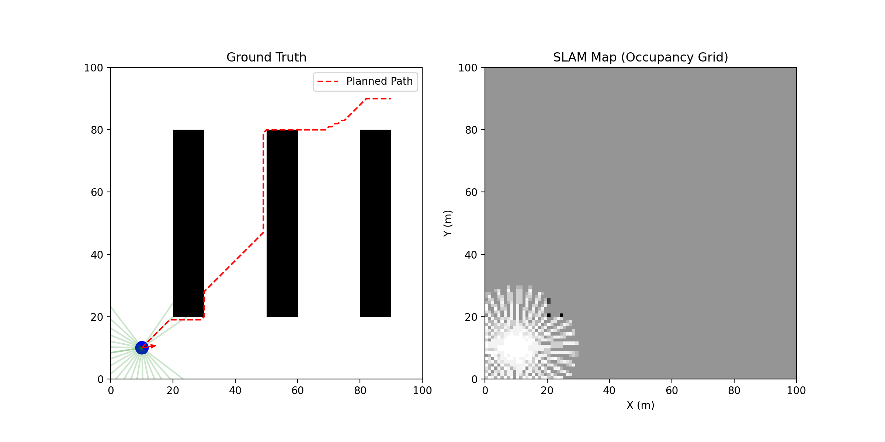

# Level 1: 2D Warehouse Rover Simulation

A 2D simulation of an autonomous warehouse rover using Matplotlib for visualization, featuring LiDAR sensing, A* path planning, and SLAM mapping.

## Features

- **2D Visualization**: Real-time Matplotlib rendering with dual-panel view
- **Kinematics**: Simple differential drive model
- **LiDAR Sensor**: 360° ray-casting with 36 rays, 20m range
- **Path Planning**: A* algorithm with 8-directional movement
- **Path Following**: Pure Pursuit controller with dynamic lookahead
- **Mapping**: Occupancy grid-based SLAM

## Quick Start

### Installation

```bash
# Create conda environment
conda create -n level1_2d_sim python=3.14
conda activate level1_2d_sim

# Install dependencies
pip install numpy matplotlib
```

### Running the Simulation

```bash
python3 src/main.py
```

## How It Works

### Left Panel: Ground Truth
- Warehouse environment with obstacles (shelves)
- Blue circle: Robot position
- Red arrow: Robot heading direction
- Green rays: LiDAR scans
- Red dashed line: Planned path (A*)

### Right Panel: SLAM Map
- Occupancy grid built from LiDAR data
- White: Free space
- Black: Obstacles
- Gray: Unknown/unexplored

## Results

The robot successfully:
- Plans optimal collision-free paths around obstacles
- Follows paths using Pure Pursuit control
- Builds accurate maps of the environment using SLAM
- Reaches goals autonomously in 100-200 simulation steps

### Demo


*Left: Ground truth environment with robot, obstacles, LiDAR rays, and planned path. Right: SLAM-built occupancy grid map*

### Animation


*Real-time simulation showing autonomous navigation and mapping*

### Sample Run
- **Start**: (10, 10)
- **Goal**: (90, 90)
- **Path Length**: ~121 waypoints
- **Completion**: Goal reached successfully

## Architecture

```
src/
├── main.py              # Entry point, simulation loop
├── simulation/
│   └── environment.py   # GridMap, obstacle management, rendering
├── robot/
│   └── rover.py         # Rover class, Lidar sensor, kinematics
├── navigation/
│   ├── planner.py       # A* pathfinding
│   └── controller.py    # Pure Pursuit controller
└── perception/
    └── slam.py          # Occupancy grid mapping
```

## Algorithm Parameters

### A* Planner
- **Grid Resolution**: 1.0m
- **Heuristic**: Euclidean distance
- **Motion Model**: 8-connected (cardinal + diagonal)

### Pure Pursuit Controller
- **Lookahead Distance**: 5.0m
- **Linear Gain (Kp)**: 1.0
- **Angular Gain (Kp)**: 2.0
- **Max Linear Velocity**: 5.0 m/s
- **Max Angular Velocity**: ±2.0 rad/s

### LiDAR
- **Field of View**: 360°
- **Number of Rays**: 36
- **Max Range**: 20.0m
- **Min Range**: 0.0m

## Customization

### Change Environment
Edit `main.py` to modify obstacle positions:
```python
env.add_obstacle(x, y, width, height)
```

### Adjust Robot Parameters
Modify in `rover.py`:
```python
self.v = 0.0  # Linear velocity
self.w = 0.0  # Angular velocity
```

### Tune Controller
Update gains in `controller.py`:
```python
def __init__(self, kp_linear=1.0, kp_angular=2.0)
```

## Next Steps

- [ ] Add more complex warehouse layouts
- [ ] Implement dynamic obstacles
- [ ] Add path replanning
- [ ] Export map data for analysis
- [ ] Integration with Level 2 (3D simulation)

## Citation

If you use this simulation in your research, please cite:

```bibtex
@software{warehouse_rover_2d,
  title = {Level 1: 2D Warehouse Rover Simulation},
  author = {K. Bhuvan Tej},
  year = {2025},
  url = {https://github.com/K-bhuvan/project1_warehouse_automation}
}
```

## License

MIT License - See main repository LICENSE file.
